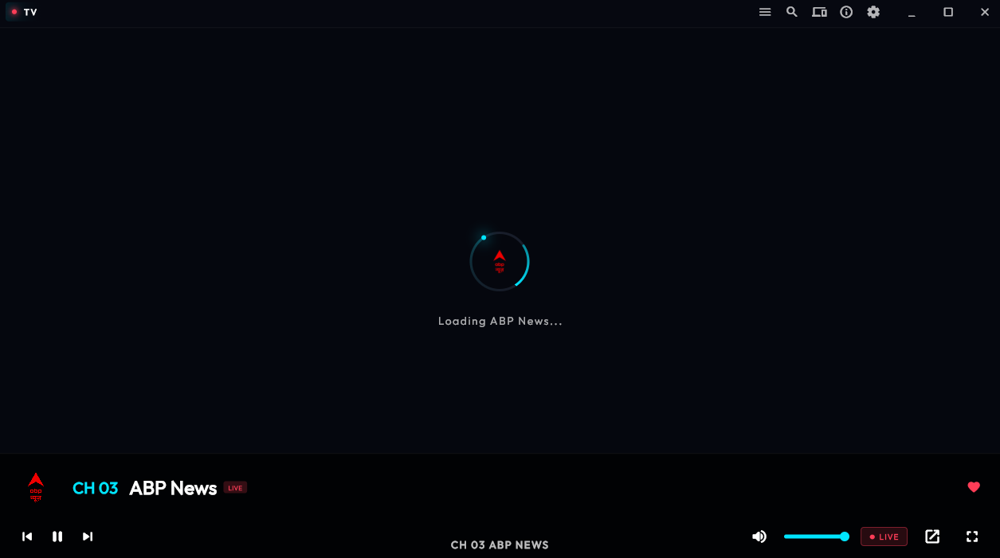
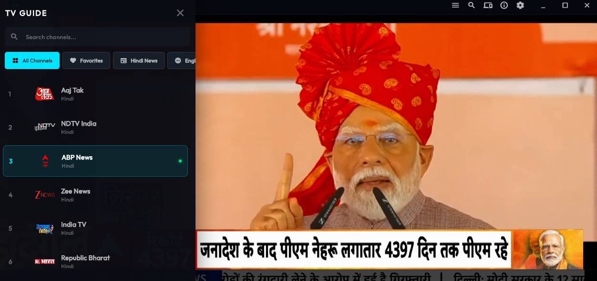
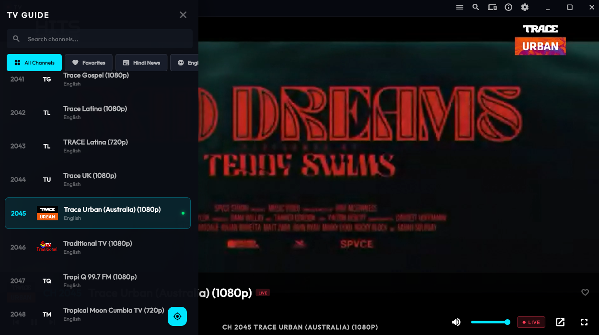
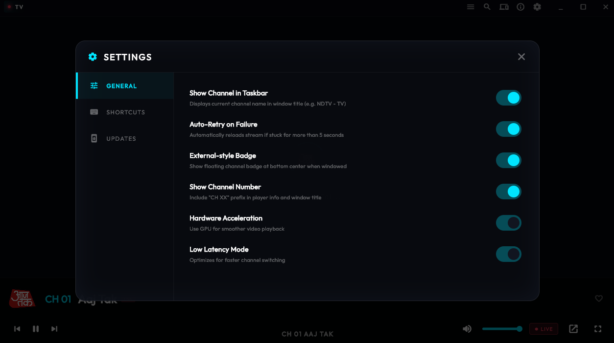
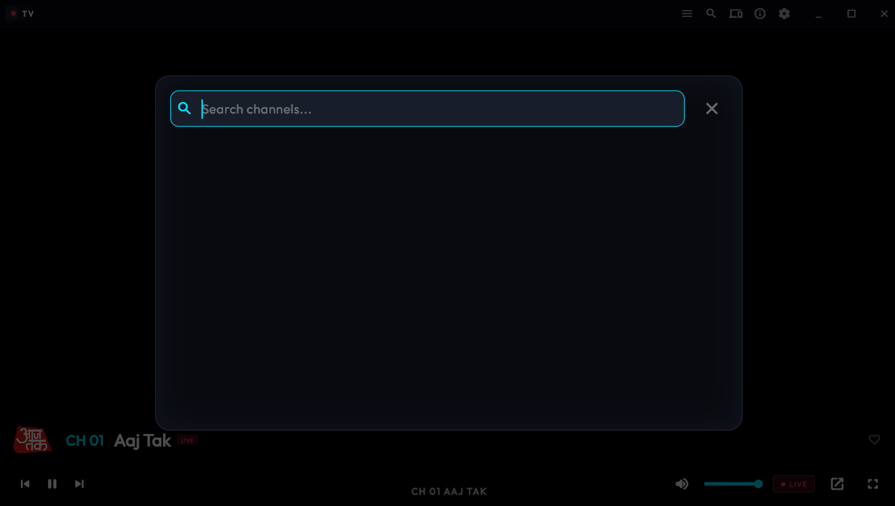

# News TV 📺

<p align="left">
  
  
  
  
</p>

Premium Live TV Desktop Application built with Flutter. Experience seamless streaming with a modern UI, remote control support, and intelligent zapping.


## 📸 Screenshots

<p align="center">
  
  
</p>
<p align="center">
  
  
</p>
<p align="center">
  
  
</p>

## ✨ Features

- **High-Performance Streaming**: Powered by `media_kit` for low-latency, high-quality playback.
- **Smart TV Guide**: Easily navigate through categories (News, Movies, Sports, etc.) with real-time search.
- **Remote Control Integration**: Control your TV app using a mobile remote (QR code pairing).
- **Favorites System**: Quick access to your most-watched channels.
- **Modern UI/UX**: Dynamic overlays, smooth animations, and a responsive settings panel.
- **Customizable**: Toggle hardware acceleration, low-latency mode, and window appearance.

## 📱 News TV Remote

Control your viewing experience directly from your Android device. The companion remote app allows for seamless channel switching, volume control, and navigation via a simple QR code scan.

### Download Remote APK
You can download the latest version of the **News TV Remote APK** from the [GitHub Releases](https://github.com/mahtab-jack/News-TV/releases) section.

1. Download `news_tv_remote.apk` to your Android phone.
2. Install the APK (enable "Install from unknown sources" if prompted).
3. Open the app and scan the QR code displayed on your TV screen to pair.

## 🚀 Getting Started

### Prerequisites

- [Flutter SDK](https://docs.flutter.dev/get-started/install)
- [Git](https://git-scm.com/downloads)
- [Visual Studio](https://visualstudio.microsoft.com/downloads/) (for Windows desktop development)

### Installation

1. **Clone the repository:**
   ```bash
   git clone https://github.com/mahtab-jack/News-TV.git
   cd News-TV/tv_app
   ```

2. **Install dependencies:**
   ```bash
   flutter pub get
   ```

3. **Run the application:**
   ```bash
   flutter run -d windows
   ```

## 📦 Building Installers

### MSIX Package
```bash
flutter build windows
dart run msix:create
```

### Inno Setup (EXE)
1. Open `installer.iss` in Inno Setup Compiler.
2. Compile to generate `NewsTV_Setup.exe`.

## 🛠 Built With

- [Flutter](https://flutter.dev/) - UI Framework
- [Media Kit](https://media-kit.100ms.live/) - Video Playback
- [Shared Preferences](https://pub.dev/packages/shared_preferences) - Local Storage
- [QR Flutter](https://pub.dev/packages/qr_flutter) - QR Code Generation

## 👤 Author

**Mahtab Jack**
- GitHub: [@mahtab-jack](https://github.com/mahtab-jack)

## 📄 License

This project is licensed under the MIT License - see the [LICENSE](LICENSE) file for details.
